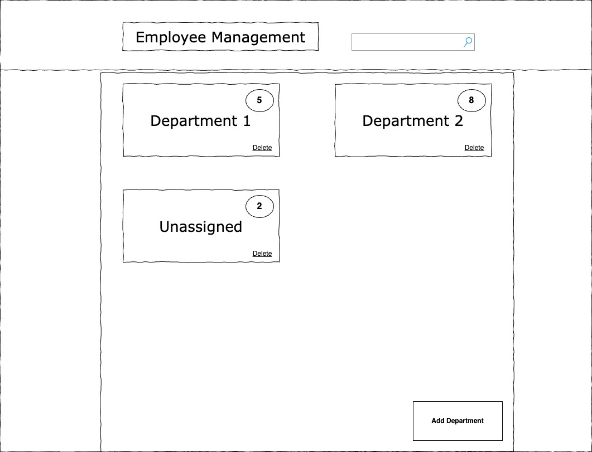
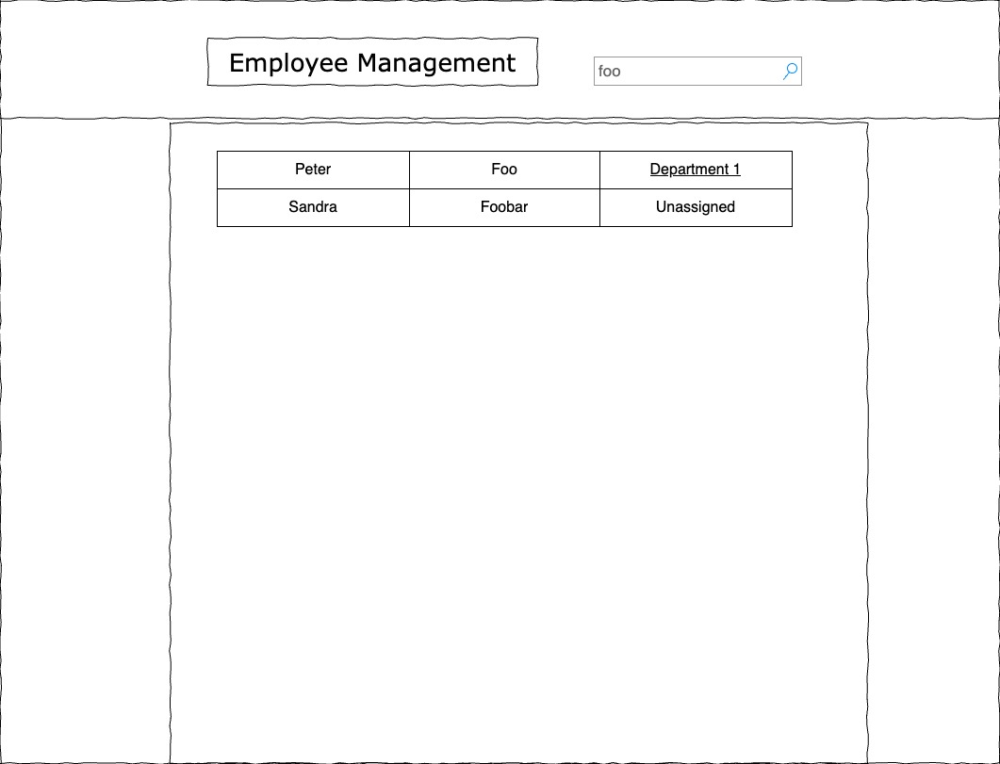
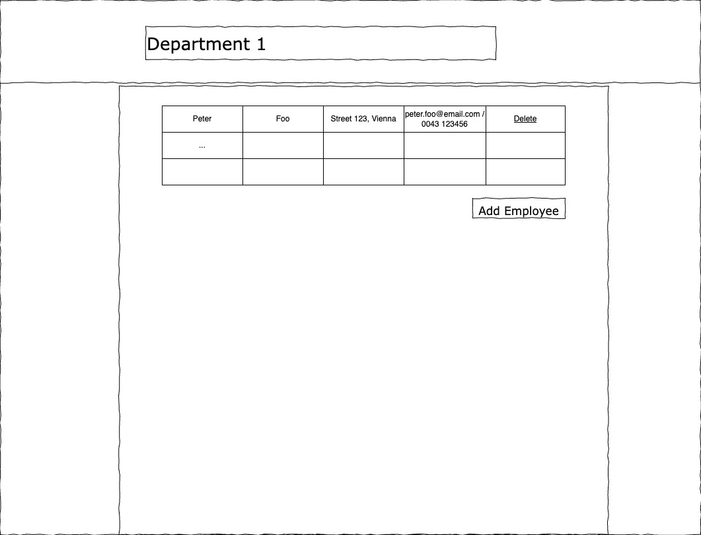

# Employee Management: Technical Specification

Design and implement a simple web application with both frontend and backend components. The application will support managing employees within an organization structured into multiple, independent departments.

- **Frontend**: Angular  
- **Backend**: Quarkus
- **Database**: Use Hibernate and PostgreSQL DB for persistence of employee and department data  

---

## 1. Core Features

### Department Management

- Create, read, update, and delete departments  
- Each department must have a unique name  
- Departments have no relationships with each other

### Employee Management

- Create, read, update, and delete employees  
- Capture basic contact information: full name, address, phone number, and email address  
- Each employee may only be assigned to a single department  
- Employees have no relationships with each other

---

## 2. User Interface

### Dashboard View

- Displays a list of all departments with their respective names and employee counts  
  - If there are employees not assigned to any department, a department named “Unassigned” should be displayed with the corresponding employee count  
- Clicking a department navigates to the department view  
- Provides functionality to add new departments and delete existing ones  
  - Editing existing departments is not required via the frontend  
  - Deleting an existing department moves all previously assigned employees to the "Unassigned" department

- Search bar: If it has a value, it searches for employees by name. Results should be displayed in a simple table; clicking on a result navigates to the assigned department's view

### Department View

- Lists all employees assigned to the selected department by name  
- Provides functionality to add new employees and delete existing ones  
  - Editing existing employees is not required via the frontend  
- Includes a basic search feature to find employees by name  
  - Search results should display the employee’s full name and their assigned department  
  - Clicking an employee in the results navigates to the respective employee view

To add new departments or employees, you can implement modals or any other simple form to enter and submit the required information.

---

## 3. Additional Information

### General

- You can either use the provided Angular/Quarkus starter template or implement your own solution  
  - You may also use Spring Boot for the backend if you prefer  
  - Choosing a different template or using Spring Boot will **not** negatively impact your submission in any way  
- We appreciate efforts toward designing a performant and thoughtful solution.However, we don't want you to dedicate crazy hours - keep it simple, but clean. 
- Upon completion, please share access to your project repository (e.g., via a GitHub link)  
- During the interview, we will conduct a code-review-style discussion of your solution. Be prepared to explain your design choices and the concepts you applied  

### Backend

- Even though the frontend does not require editing existing departments or employees, the backend **should** support updating these entities  
- Comprehensive testing is not required; however, please include some basic tests for selected components as representative examples  

### Frontend

- The provided UI mockups are examples only. You may follow them or create your own layout, as long as the functional requirements are met  
- UI polish is not required! You also don’t need to include “fancy extras” like input validation, etc.  
- Comprehensive testing is not required; however, please include some basic tests for selected components as representative examples  
 
